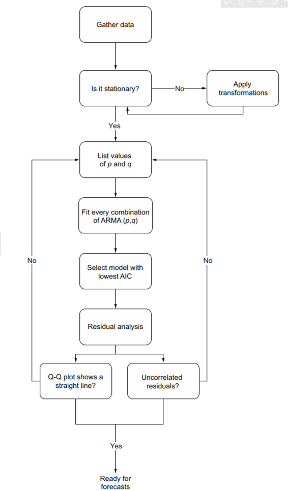

# Simulating an *Auto-Regressive Moving Average* process in time series
The purpose of this reppository is learning to identify an Auto-Regressive Moving Average process. In order to do that, the definition and the process to identify this sort of series is presented. The next diagram shows the general process:

An ARMA(2,2) process will be simulated using the equation:
$$y_t = C + \phi_1 y_{t-1}+ \phi_2 y_{t-2} + \cdots + \phi_p y_{t-p} + \mu +  \epsilon_t + \theta_1 \epsilon_{t-1} + \theta_2 \epsilon_{t-2} + \cdots + \theta_q \epsilon_{t-q}$$
The actions to execute are:
1. Gather data: Simulate the $ARMA(2,2)$ model with the above equation.
2. Test stationary (*Augmented Dickey-Fuller  test*).
    - Apply transformations until our series is stationary (Differences).
3. Generate a list of $(p,q)$ candidates to approximate our model.
4. Get the best candidate, ie, fit every combination of $(p,q)$ and get the Akaike Information Criterion (*AIC*) for each model.
5. Select the model with the lowest *AIC* and apply a residual analysys (quantitative and cualitative).
    - If the model does not pass the residual analysis, the model choosen was not correct and it is necessary to select another $(p,q)$ combination.
5. Apply a method to forecast for the winner model.

Bibliography:
- Peixeiro, M. (2022). Time Series Forecasting in Python (1st ed., Chapter 6, pp. 101-139). Manning Publications.
